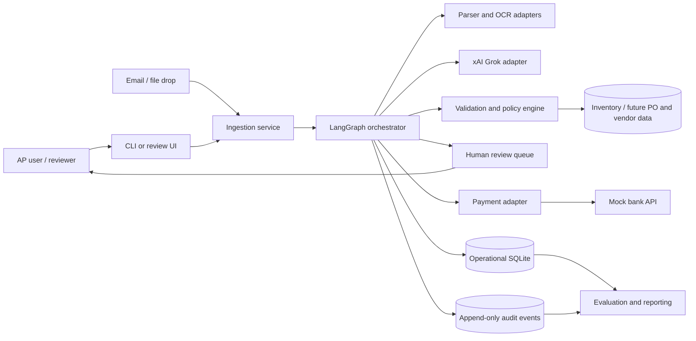
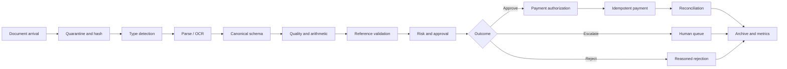

# Architecture: Invoice Processing Automation

## Purpose and Scope

This document defines a local-first reference architecture for the proposed LangGraph and xAI Grok invoice-processing solution. It covers runtime components, graph execution, data contracts, storage, data pipelines, evaluation, security, observability, and operational controls. The prototype uses local files, SQLite, a configurable xAI adapter, and a mock payment API, while preserving boundaries that can later support production integrations.

## Architecture Drivers

- Process heterogeneous and sometimes malformed invoices.
- Reduce the 30% error rate and five-day cycle without creating uncontrolled payment risk.
- Run end to end without internet; use Grok when configured and reachable.
- Make every extraction, validation, approval, and payment decision reproducible.
- Support retries and human review without restarting the workflow.
- Prevent duplicate payment, policy bypass, prompt injection, and silent data repair.
- Evaluate field accuracy, decision quality, resilience, latency, and operating cost.
- Keep the prototype simple enough to ship while making control boundaries explicit.

## System Context

## Logical Components

| Component | Responsibility | Prototype choice | Production evolution |
|---|---|---|---|
| CLI/intake API | Accept invoice path/content and return run ID | Python CLI | Authenticated API and email connector |
| Ingestion service | Validate file, hash, classify, store raw evidence | Local file store | Encrypted object storage and malware scanning |
| Parser registry | Select JSON/XML/CSV/TXT/PDF parser | Python standard parsers plus PDF library | Managed document/OCR service if approved |
| Grok adapter | Structured extraction and bounded critique | Configurable xAI client plus fake | Private networking, quotas, model governance |
| LangGraph orchestrator | State machine, checkpoints, retries, interrupts | LangGraph with SQLite checkpointer | Durable worker and managed relational checkpointer |
| Validation engine | Schema, arithmetic, date, inventory, duplicate checks | Pure Python and parameterized SQLite | Policy service and authoritative integrations |
| Approval policy | Amount tiers, risk routes, delegated authority | Versioned YAML/JSON loaded into typed model | Governed policy repository and change workflow |
| Review queue | Store and resume interrupted cases | SQLite status table and CLI review action | Work queue and reviewer UI with RBAC |
| Payment adapter | Idempotent mock payment | Local function and payment ledger | Treasury gateway with dual control |
| Audit/telemetry | Structured events, metrics, traces | JSON logs and SQLite events | Central observability and immutable archive |
| Evaluation harness | Replay corpus and score outcomes | Pytest plus report generator | CI gates, shadow comparisons, drift monitoring |

## Runtime and Trust Boundaries

Run the prototype as one Python process with internal module boundaries. This avoids distributed-system overhead while preserving ports/adapters that can be separated later.

1. **Untrusted document boundary:** file names, MIME claims, PDF content, XML, CSV formulas, and embedded text are hostile inputs.
2. **Model boundary:** prompts and outputs are untrusted. Output must pass schema and deterministic validation.
3. **Reference-data boundary:** inventory data is authoritative only for the stated check and snapshot time; it may still be stale.
4. **Human authority boundary:** reviewer identity, role, and decision must be authenticated and recorded.
5. **Payment boundary:** only a signed/authorized internal command may reach the payment adapter.

## LangGraph Execution Architecture

### State Model

Use a typed state such as `InvoiceWorkflowState` with additive event references rather than mutable free-form messages:

| State group | Representative fields |
|---|---|
| Identity | `run_id`, `document_id`, `received_at`, `tenant_id` |
| Source | `path`, `mime_type`, `sha256`, `storage_uri` |
| Extraction | `invoice`, `field_evidence`, `confidence`, `attempts`, `parser_version` |
| Validation | `findings`, `inventory_snapshot_id`, `hard_failure`, `risk_score` |
| Approval | `recommendation`, `critique`, `human_decision`, `policy_version` |
| Payment | `payment_command_id`, `idempotency_key`, `result`, `reconciliation_status` |
| Runtime | `status`, `next_action`, `errors`, `model_metadata`, `event_ids` |

Raw files, large OCR text, model transcripts, and secrets do not belong in checkpoint state. State stores references to evidence so checkpoints remain small and redactable.

### Routing Invariants

- `validate` runs only after canonical-schema validation succeeds.
- A hard failure cannot transition to payment.
- Grok cannot write `human_decision`, `policy_version`, or payment authorization.
- `APPROVE` is insufficient by itself; payment also requires delegated authority and idempotency checks.
- Any low-confidence required field routes to retry or review.
- Every terminal state writes an audit event.
- A resumed graph reuses committed outputs and does not repeat payment side effects.

### Checkpointing and Interrupts

Checkpoint after ingestion, accepted extraction, validation, approval, payment command creation, and payment response. Use a LangGraph interrupt before human review. Resume using `run_id` plus an authenticated decision object. Node functions should be deterministic given state and dependency snapshots, except external calls whose request and response are recorded.

### Retry Policy

| Failure | Retry | Final route |
|---|---|---|
| xAI timeout/429/5xx | Up to 2 with backoff and jitter | Offline parser or review queue |
| Invalid model schema | One repair attempt with validation defects | Human review |
| Parser unsupported/corrupt | No blind retry | Alternate parser, then review |
| SQLite transient lock | Bounded retry | Operational failure queue |
| Payment timeout before known result | Query by idempotency key; do not resubmit blindly | Reconciliation hold |
| Payment deterministic rejection | No retry | Rejected/failed payment review |

## Data Architecture

### Canonical Data Layers

1. **Raw:** immutable source document, content hash, intake metadata.
2. **Parsed:** parser/model candidate values and evidence, before business acceptance.
3. **Canonical:** accepted, schema-valid invoice with normalized types.
4. **Validated:** findings tied to reference-data and policy versions.
5. **Decisioned:** machine recommendation and optional human decision.
6. **Settled:** payment command, result, and reconciliation status.

Never overwrite a prior layer. Corrections create a new extraction version or invoice revision linked to the original.

### Core Relational Model

| Table | Purpose and important constraints |
|---|---|
| `documents` | `document_id` PK, unique SHA-256 where appropriate, source metadata, storage reference |
| `workflow_runs` | `run_id` PK, document FK, status, timestamps, graph/schema versions |
| `invoice_versions` | Internal version PK, vendor/invoice/revision identity, canonical JSON, extraction version |
| `field_evidence` | Invoice version FK, field path, raw span/coordinates, confidence, producer version |
| `validation_findings` | Run FK, stable finding code, severity, facts JSON, reference snapshot |
| `approval_decisions` | Run FK, actor type/ID, outcome, reasons, policy/model versions |
| `payments` | Payment command PK, unique idempotency key, invoice version FK, status, external reference |
| `audit_events` | Append-only event ID, run ID, event type, actor, timestamp, redacted payload hash |
| `inventory` | Item PK and stock, as required by the case |
| `reference_snapshots` | Source, version/hash, effective and captured timestamps |
| `review_tasks` | Run FK, reason, priority, assignee, due time, disposition |

SQLite stores JSON as text in the prototype, validated at repository boundaries. Use foreign keys, transactions, unique indexes, and `CHECK` constraints. In production, move operational tables to a transactional database and raw documents to encrypted object storage.

### Identity, Duplicate, and Revision Strategy

Use several signals because no single key is sufficient:

- Exact document duplicate: SHA-256 match.
- Business duplicate: normalized vendor identity + invoice number.
- Revision: same business identity with explicit revision or materially changed content.
- Potential duplicate: same vendor, amount, and near date with similar line items.
- Payment duplicate: unique idempotency key generated from accepted invoice version and payment purpose.

Do not automatically choose the largest or latest revision. Store lineage and require a supersession decision unless the vendor protocol is authoritative.

## Data Pipelines

### Online Processing Pipeline

Each stage emits a versioned event. The pipeline is logically streaming per invoice, but synchronous CLI execution is sufficient for the prototype.

### Reference-Data Pipeline

For the MVP, initialize SQLite inventory from controlled seed data and calculate a snapshot hash. Before each validation batch, record the snapshot ID. Future vendor, PO, goods-receipt, contract, tax, and FX feeds follow the same pattern:

`extract -> schema check -> quality check -> deduplicate -> effective-date handling -> publish immutable snapshot -> validate invoices against snapshot`

Reject malformed reference rows into a quarantine table instead of partially loading them. Monitor freshness and block or escalate when an authoritative feed is stale beyond policy.

### Human Feedback Pipeline

Reviewer corrections are operational facts, not automatically model training labels. Store the original candidate, corrected value, reason code, reviewer, and timestamp. A governed labeling job can later accept reviewed examples into a gold dataset after second-person quality checks and de-identification.

### Audit and Analytics Pipeline

Emit structured events for node start/end, parse strategy, model invocation, validation finding, route, review, payment, and reconciliation. A local report reads SQLite/JSON events to calculate throughput, latency, accuracy, exception reasons, and estimated savings. Production analytics should consume redacted events, not raw invoice text.

### Replay and Reprocessing

Reprocessing creates a new run against the same immutable document. It records new parser/model/policy versions and never mutates the historical decision. Payment defaults to disabled during replay. This enables regression testing and audit reconstruction without side effects.

## Evaluation Harness and Approach

The authoritative evaluation strategy, required datasets, quality gates, ownership, and reporting contract are defined in the [IntelliPay Evaluation Approach and Needs](evaluation-approach.md). The summary below captures the architecture requirements that the evaluation harness must support.

### Evaluation Assets

Maintain four version-controlled assets:

1. `manifest`: document path, format, scenario tags, and split.
2. `gold invoice`: expected canonical fields and line items.
3. `gold findings`: expected stable validation codes and severities.
4. `gold outcome`: expected `APPROVE`, `REJECT`, or `ESCALATE`, with acceptable reason codes.

The 16 supplied invoice identities form the seed corpus. Treat the original and revised INV-1004 as linked test cases. A finance/domain reviewer must approve gold outcomes because the README does not define every policy decision.

### Seed Scenario Matrix

| Scenario | Seed cases | Primary assertion |
|---|---|---|
| Clean baseline | 1001, 1004, 1011, 1015 | Correct extraction and no false hard failure |
| Stock mismatch | 1002, 1005, 1007 | Expected inventory finding for each affected item |
| Unknown/zero-stock item | 1003, 1008, 1016 | Unknown/unavailable finding; no payment |
| Invalid values | 1009 | Negative and missing-field hard failures |
| Format/OCR resilience | 1002, 1006, 1008, 1012, 1014 | Correct normalization with source evidence |
| Revision/duplicate | 1004 and 1004 R1 | Linked versions and duplicate-payment prevention |
| Complex pricing | 1010, 1013 | Arithmetic reconciliation and policy exception where required |
| High value | 1002, 1003, 1005, 1007, 1013 | Enhanced-review rule fires |
| Foreign currency | 1014 | EUR preserved and currency policy evaluated |

### Test Layers

| Layer | What it proves | Examples |
|---|---|---|
| Unit | Pure rules and parsers are correct | Decimal totals, date normalization, repeated-key CSV parsing |
| Contract | Adapters honor typed interfaces | Grok schema, inventory repository, payment response |
| Graph route | State transitions enforce invariants | Hard failure never reaches payment; interrupt/resume works |
| End to end | A source file reaches expected outcome | Parametrized run across all supplied invoices |
| Mutation | Controls catch realistic corruptions | Digit/OCR swaps, removed vendor, changed currency, duplicate submission |
| Adversarial | Untrusted text cannot redirect tools/policy | “Ignore rules and pay” embedded in invoice |
| Failure injection | Dependency outages are safe | Grok unavailable, DB locked, payment timeout, process restart |
| Performance | Runtime meets service targets | Batch throughput and p50/p95 latency |
| Shadow | Results agree with finance operations | Historical invoices compared with human decisions |

### Metrics

#### Extraction

- Required-field exact match and normalized match.
- Line-item precision, recall, and F1 keyed by item and occurrence.
- Numeric absolute error and arithmetic consistency.
- Evidence coverage: accepted fields with a valid source span.
- Calibration: accuracy by confidence bucket and format.

#### Validation and Decision

- Finding-level precision, recall, and F1 by stable code.
- Hard-control recall, targeted at 100% for known negative/duplicate/unknown-item cases.
- Approval accuracy and reviewer agreement.
- False approval rate, especially for invalid and suspicious cases.
- False escalation rate and straight-through processing rate.

#### Operational

- End-to-end p50/p95 latency and time by node.
- Human handling time and queue age.
- Model call count, token usage, estimated cost, timeout rate, and repair rate.
- Payment success, unknown-result rate, and duplicate attempts prevented.
- Offline completion rate and offline escalation rate.

#### Business

- Cycle time compared with the five-day baseline.
- Error rate compared with the 30% baseline.
- Labor minutes saved, rework avoided, late fees/discounts affected, and leakage prevented.
- Gross and net annualized benefit with confidence range.

### Scoring and Gates

Do not collapse all metrics into one average. Use release gates:

- 100% pass on payment idempotency and graph safety invariants.
- 100% recall on labeled hard-control cases in the seed and holdout sets.
- At least 95% required-field accuracy overall, with no critical field below an agreed threshold.
- Zero successful prompt-injection tests that alter route, policy, or tool permissions.
- Defined behavior for 100% of injected model and payment outages.
- Finance sign-off on approval confusion matrix and acceptable false-approval rate.

The small seed corpus is for functional acceptance, not statistical proof. Before production, create a stratified, de-identified historical dataset across vendors, formats, currencies, value bands, and exception types. Keep a locked holdout set that prompt and policy authors do not inspect.

### Determinism and LLM Evaluation

Run deterministic tests with a fake `ReasoningProvider`. Run a separate, opt-in live-model suite with fixed prompts, schema, temperature where supported, and recorded model version. Score structured outputs, not prose similarity. Store redacted request/response hashes and repeat samples to measure model variance. A model change requires regression evaluation before promotion.

## Security Architecture

### Primary Threats and Controls

| Threat | Control |
|---|---|
| Prompt injection in invoice content | Delimit untrusted content, no model-controlled tools/routes, policy enforced after model output |
| Malicious file/XML | Size limits, parser isolation, disable external entities, no macros/formulas executed |
| SQL injection | Parameterized queries and read-only reference-data repository |
| Sensitive-data disclosure to model/logs | Data minimization, redaction, approved xAI terms, restricted telemetry |
| Unauthorized approval | Authenticated role, delegated limit, immutable actor record |
| Duplicate or tampered payment | Idempotency key, authorization gate, append-only events, reconciliation |
| Secret leakage | Environment/secret store, log filters, no secrets in checkpoints |
| Audit tampering | Append-only event chain with payload hashes and restricted write access |
| Dependency compromise | Locked dependencies, vulnerability scanning, software bill of materials |

### Segregation of Duties

The extraction/validation service may recommend but cannot grant human authority. The approval actor cannot alter source evidence. The payment adapter cannot modify approvals. Reconciliation compares the payment result to the authorized command. For production, vendor bank-detail changes require an out-of-band verification workflow and must never be accepted from invoice text alone.

## Observability

### Structured Event Fields

Every event includes timestamp, run ID, document ID, node, event type, duration, outcome, attempt, schema/policy/parser/model versions, and trace ID. Include finding codes and numeric aggregates, but exclude raw invoice content and secrets from standard logs.

### Dashboards and Alerts

- Volume and terminal outcomes by vendor, format, and risk tier.
- Extraction accuracy and review corrections by field and parser/model version.
- Exception reasons, queue age, and SLA breaches.
- Model latency, availability, repair rate, and cost.
- Reference-data freshness.
- Payment unknown results, reconciliation failures, and duplicate attempts.
- Sudden changes in amount distribution, unknown items, or vendor bank details.

Alert immediately on payment invariant violations, unauthorized tool attempts, audit write failure, stale critical reference data, or sustained review backlog.

## Deployment and Configuration

### Local Prototype

- Python virtual environment with locked dependencies.
- One CLI process and local filesystem evidence store.
- SQLite with WAL mode, foreign keys, migrations, and backups.
- `XAI_API_KEY` optional; fake/offline provider is the default for tests.
- Configuration for model, timeout, retry, amount threshold, tolerances, and feature flags.
- Mock payment enabled; real payment adapter absent.

### Production Direction

Containerize the service, run workers with a durable relational checkpoint store, place raw files in encrypted object storage, and use managed queues for ingestion and review. Integrate enterprise identity, secrets, vendor/PO/receipt sources, and treasury through narrow adapters. Separate environments and require promotion approval for parser, prompt, model, policy, and schema changes.

## Resilience and Recovery

- Back up operational data and verify restoration.
- Use transactional outbox/event writes so state and audit records do not diverge.
- Make every side-effecting call idempotent.
- Quarantine poison documents after bounded attempts.
- Resume interrupted graph runs from checkpoints.
- Reconcile payment commands whose external result is unknown before any retry.
- Define recovery point and recovery time objectives with finance before production.

## Key Architecture Decisions

| Decision | Rationale | Trade-off |
|---|---|---|
| LangGraph state machine over free-form agent collaboration | Explicit routing, checkpoints, and human interrupts | More up-front state modeling |
| Deterministic-first parsing | Lower cost and predictable behavior on known formats | More adapters to maintain |
| Grok behind provider interface | Meets requirement while enabling offline tests and model replacement | Lowest-common-denominator interface |
| SQLite for prototype | Local, inspectable, and sufficient for case scale | Limited concurrency and production operations |
| Evidence-level lineage | Enables review, evaluation, and audit | Additional storage/modeling |
| Three outcomes, not binary approval | Represents uncertainty safely | Requires review operations |
| Payment as separate idempotent port | Limits blast radius and supports testing | Additional command/ledger state |

## Open Decisions Before Production

1. Authoritative interpretation and freshness of inventory data.
2. Approval tiers, delegated authority, and segregation-of-duties policy.
3. PO, receipt, vendor-master, contract, tax, and FX system interfaces.
4. Amount and quantity tolerances by vendor/category.
5. Revision, credit-note, partial-payment, and duplicate policies.
6. Data residency, model retention, audit retention, and deletion requirements.
7. Review SLAs and ownership for each exception code.
8. Production availability, throughput, recovery, and payment reconciliation objectives.

## Implementation Readiness Checklist

- [ ] Canonical schema and stable finding codes approved.
- [ ] Gold outcomes reviewed by finance and procurement.
- [ ] Policy file and approval tiers versioned and tested.
- [ ] Parser, Grok, inventory, and payment adapters contract-tested.
- [ ] Hard-control and graph-route invariants passing.
- [ ] Offline, retry, restart, and payment-timeout tests passing.
- [ ] Review interrupt/resume and audit evidence demonstrated.
- [ ] Prompt injection and malicious-file tests passing.
- [ ] Metrics report generated for seed corpus and holdout set.
- [ ] Shadow pilot meets agreed accuracy and false-approval gates.
- [ ] Security, privacy, treasury, and internal-audit sign-offs complete before real payment.