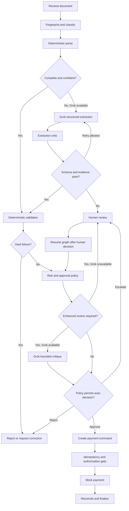

# Proposed Solution: Controlled Invoice Automation with LangGraph and xAI Grok

## Solution Overview

Build a local Python service that processes each invoice through a durable LangGraph workflow. Deterministic parsers and financial controls establish facts; xAI Grok handles ambiguous extraction and critiques high-risk approval recommendations; LangGraph controls state, retries, escalation, and terminal outcomes. Payment remains a tightly scoped tool that can be called only after all required gates pass.

This is a multi-agent system in responsibility, but not a collection of unconstrained agents chatting with one another. Each node has a typed input, a typed output, a limited tool set, and an explicit transition policy. That design delivers the requested agentic behavior while preserving the predictability expected of an accounts-payable control system.

## Design Principles

1. **Rules decide hard constraints.** Negative quantities, missing required fields, arithmetic failures, unknown items, duplicate payments, and approval limits are code and policy, not model opinions.
2. **Grok resolves ambiguity.** Use the model for noisy text extraction, field normalization, anomaly explanation, and bounded critique where deterministic methods are insufficient.
3. **Uncertainty becomes a route.** Low confidence leads to retry or human review, never silent guessing.
4. **Source evidence is immutable.** Store the original document hash, extracted spans, normalized values, and transformations.
5. **Payment is least-privileged and idempotent.** The payment tool receives only an approved payment command and rejects repeated idempotency keys.
6. **Offline behavior is explicit.** Known formats continue through deterministic controls; ambiguous cases wait for review or model availability.

## User Experience

The prototype supports the required command-line flow:

```bash
python main.py --invoice_path=data/invoices/invoice_1001.txt
```

It should return a concise result and write a complete structured trace:

```json
{
  "run_id": "...",
  "invoice_number": "INV-1001",
  "status": "APPROVED",
  "risk": "LOW",
  "payment_status": "SUCCESS",
  "reasons": ["required fields present", "inventory checks passed"],
  "review_required": false
}
```

Reviewers should see the source document, normalized fields, confidence, validation findings, relevant policy, revision history, and a clear approve/reject/request-correction action. The MVP may expose this as a structured terminal report; a lightweight review UI is the next increment.

## Canonical Invoice Contract

All formats normalize to one versioned schema before validation:

```python
class Invoice:
    schema_version: str
    source_document_id: str
    invoice_number: str | None
    revision: str | None
    vendor_name: str | None
    invoice_date: date | None
    due_date: date | None
    currency: str | None
    line_items: list[LineItem]
    subtotal: Decimal | None
    tax: Decimal | None
    shipping: Decimal | None
    total: Decimal | None
    payment_terms: str | None
    purchase_order_number: str | None
    field_evidence: dict[str, Evidence]
    warnings: list[str]
```

Money uses `Decimal`, not floating point. Evidence includes source text or coordinates, parser/model identity, confidence, and any normalization. An LLM response must validate against this schema before entering the graph state.

## LangGraph Workflow



### Shared Graph State

The graph state contains only durable, serializable data: run and document identifiers, canonical invoice, extraction attempts, validation findings, risk signals, approval recommendation, human decision, payment command/result, policy version, model metadata, and event references. Secrets and live database connections are injected into nodes, never serialized.

### Node Responsibilities

| Node/agent | Responsibilities | Allowed tools |
|---|---|---|
| Ingestion/intake | Hash, store, classify, reject unsupported/oversized files | File store, MIME detector |
| Extraction | Parse known formats; call Grok for ambiguity; attach evidence | Format parsers, OCR, Grok structured output |
| Extraction critic | Compare totals, dates, item counts, and evidence; request bounded retry | Arithmetic checker, schema validator |
| Validation | Apply integrity, inventory, duplicate, revision, and policy checks | Read-only SQLite queries, policy engine |
| Approval | Produce approve/reject/escalate recommendation under policy | Risk calculator, Grok critique, approval matrix |
| Human review | Pause and collect an authenticated decision | Review queue |
| Payment | Execute one authorized, idempotent command | Mock payment adapter only |
| Reconciliation | Confirm result and close or retry safely | Payment ledger, event log |

## xAI Grok Integration

### Recommended Adapter

Place xAI behind a `ReasoningProvider` interface so model use is testable and optional:

```python
class ReasoningProvider(Protocol):
    def extract_invoice(self, content: DocumentContent) -> ExtractionResult: ...
    def critique_decision(self, context: ApprovalContext) -> CritiqueResult: ...
```

The production adapter calls an approved xAI model through its current supported API or OpenAI-compatible endpoint. Endpoint, model name, API key, timeout, retry limit, and data-retention mode are configuration, not hard-coded values. A deterministic fake adapter supports local tests and the no-internet runtime.

### Model Tasks

- Convert noisy or unstructured text into the canonical schema.
- Identify source evidence for every extracted field.
- Suggest normalization for OCR artifacts without overwriting raw values.
- Summarize anomaly clusters for a reviewer.
- Critique a proposed high-value decision against supplied policy and facts.

### Tasks the Model Cannot Perform

- Directly query arbitrary databases or execute SQL.
- Change policy, approval limits, confidence thresholds, or graph routing.
- Declare unknown inventory valid.
- Repair arithmetic without recording the discrepancy.
- Call the payment tool.
- Override a hard failure or human-review requirement.

### Self-Correction Loop

The extraction loop is bounded to two model attempts. The critic returns machine-readable defects such as `TOTAL_MISMATCH`, `MISSING_VENDOR_EVIDENCE`, or `INVALID_DATE`. A retry prompt contains only those defects and the original source. If defects remain, the graph escalates. Approval critique is one pass: it may recommend a stricter result but cannot weaken hard controls.

## Deterministic Controls

### Extraction and Integrity

- Required fields and valid ISO dates.
- Positive quantities, non-negative prices, and permitted currency codes.
- Recomputed line totals, subtotal, tax, shipping, and grand total with configured tolerance.
- Distinction between absent, unreadable, inferred, and explicitly supplied values.
- File hash and content-size limits.

### Reference and Business Validation

- Item existence and requested quantity compared with inventory snapshot.
- Vendor and bank-account status when a vendor master becomes available.
- PO and goods-receipt matching when those systems become available.
- Price and tax tolerance against contract/PO policy.
- Currency and FX policy.
- Duplicate key based on vendor identity, invoice number, and revision, supplemented by document and content fingerprints.

Inventory shortage should initially be an exception, not automatically labeled invoice fraud. The customer must confirm whether inventory represents stock on hand, goods received, or purchasing capacity.

### Approval Policy

The minimum policy is:

- Hard-control failure: `REJECT` or `REQUEST_CORRECTION`.
- Duplicate payment or unverified payment-instruction change: `HOLD` and human review.
- Amount above $10,000: enhanced review; do not auto-pay until delegated authority is defined.
- Suspicious signal cluster, unknown vendor/item, unsupported currency, or low confidence: `ESCALATE`.
- Valid low-risk invoice within delegated limits: `APPROVE`.

Policy is versioned configuration with tests. Each decision records the policy version and the exact rules fired.

## Handling the Supplied Scenarios

| Scenario | Proposed behavior |
|---|---|
| INV-1001 | Parse deterministically, validate, and approve if policy permits |
| INV-1002 | Recover typos, flag quantity above inventory, and route for reconciliation; enhanced review due to amount |
| INV-1003 | Hard-stop unavailable item plus high-risk signal cluster; no payment |
| INV-1004 and R1 | Link revision lineage, prevent both versions from being paid, and require supersession decision |
| INV-1005/1007 | Flag inventory mismatch and enhanced-review threshold |
| INV-1006 | Parse repeated field/value CSV rows with a dedicated adapter |
| INV-1008/1016 | Flag unknown catalog items; do not let Grok invent mappings |
| INV-1009 | Reject negative quantity/total and missing required fields |
| INV-1010/1013 | Recompute complex totals and route price/discount exceptions to review |
| INV-1012 | Preserve OCR-like raw values, normalize with evidence, then verify arithmetic and dates |
| INV-1014 | Preserve EUR and require supported-currency/FX policy |

## Offline and Failure Behavior

When Grok is unavailable, JSON, XML, CSV, and known TXT templates continue through deterministic parsing. Clean, complete invoices may proceed only if policy explicitly permits offline approval. Ambiguous extraction, enhanced review, and unsupported formats enter a durable review queue. The system never substitutes a permissive local guess for unavailable model reasoning.

Retries use exponential backoff with jitter for transient model and payment errors. Parse errors, schema failures, and policy failures are not blindly retried. LangGraph checkpoints allow a run to resume from the last committed node after a process restart or human decision.

## Security and Governance

- Treat invoice content as untrusted input, including prompt injection instructions embedded in text.
- Allow-list tool calls per graph node and parameterize all SQL.
- Store xAI credentials in environment or secret storage; never logs or graph state.
- Redact bank, tax, address, and personal data from routine telemetry.
- Encrypt stored documents and audit records; apply role-based access.
- Separate invoice entry, approval, payment execution, and reconciliation duties.
- Record model, prompt-template, schema, parser, and policy versions.
- Review xAI data-processing and retention terms before transmitting production invoices.

## Delivery Plan

The authoritative phased delivery plan, dependencies, risks, verification steps, and functional MVP exit gates are defined in the [Functional MVP Implementation Plan](../planning/implementation-plan.md). The increments below summarize the intended progression.

### Increment 1: Reproducible Core

- Canonical models and format-specific parsers.
- SQLite inventory and event schema.
- Deterministic validation and mock payment.
- LangGraph flow with approve/reject/escalate terminals.
- Gold outcomes for the supplied corpus.

### Increment 2: Bounded Grok Reasoning

- Provider adapter and structured extraction.
- Evidence-aware extraction critic.
- High-value approval critique.
- Fake provider, timeout behavior, and offline routes.

### Increment 3: Review and Observability

- Human interrupt/resume workflow.
- Reviewer evidence view.
- Metrics, traces, prompt/model versioning, and redaction.
- Failure replay and evaluation reports.

### Increment 4: Shadow Pilot

- Historical invoice sampling and labeling.
- Vendor/PO/receipt integration discovery.
- Baseline-versus-system outcome comparison.
- Go/no-go evidence for narrowly scoped production payment.

## Acceptance Criteria

The [IntelliPay Evaluation Approach and Needs](evaluation-approach.md) defines the datasets, test layers, metrics, quality gates, ownership, and reports used to verify these criteria.

The prototype is acceptable when:

1. Every supplied invoice reaches a deterministic terminal or human-review state with a complete trace.
2. Known stock, unknown-item, negative-value, duplicate/revision, high-value, and currency cases trigger their expected controls.
3. No model output can bypass schema validation, hard rules, approval limits, or payment idempotency.
4. Grok unavailability produces defined fallback or escalation behavior without data loss.
5. Replaying the same approved invoice cannot create a second payment.
6. Evaluation can compare extracted fields, findings, decisions, latency, and cost against versioned expected outcomes.