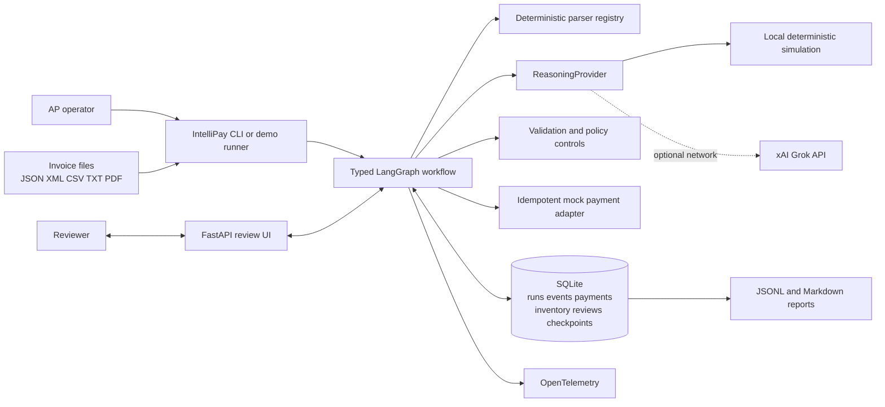
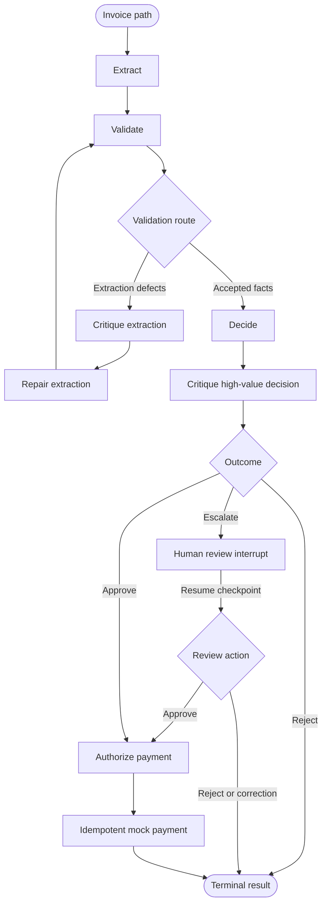
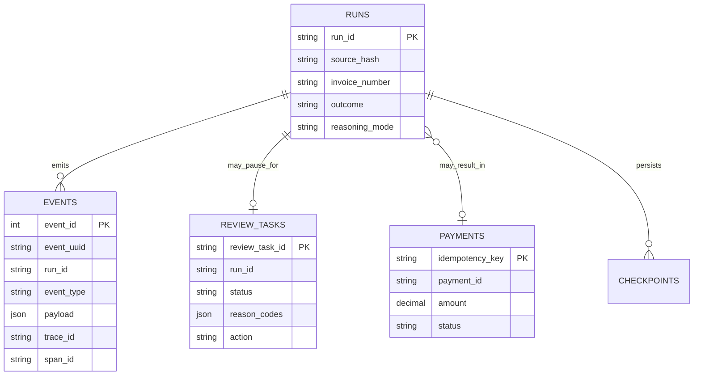
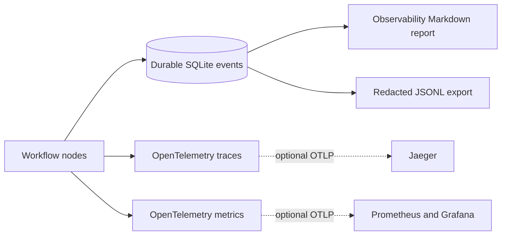

# IntelliPay Architecture

## Purpose

This document describes the architecture implemented in the current IntelliPay prototype. IntelliPay is a local-first Python application that processes invoice files through a typed LangGraph workflow, applies deterministic financial controls, uses optional xAI Grok reasoning behind a provider boundary, pauses selected cases for human review, and permits only authorized idempotent mock payments.

For the business-facing view of actors, capabilities, and end-to-end outcomes, see the [solution architecture](solution-architecture.md). Significant design choices and trade-offs are recorded in the [architecture decision records](../adr/).

## Runtime Context

The CLI, workflow, review application, adapters, and repositories run in one Python environment. SQLite is the operational store and LangGraph checkpointer. The optional observability stack receives OpenTelemetry data but does not control workflow routing or payment.

## Implemented Components

| Component | Current responsibility | Implementation |
|---|---|---|
| CLI and demo runner | Process one invoice or execute the eight-scenario presentation | `intellipay.cli`, `intellipay.demo` |
| Parser registry | Normalize JSON, XML, CSV, TXT, and PDF inputs | `intellipay.parsing` |
| Workflow orchestrator | Execute nodes, route outcomes, checkpoint, interrupt, and resume | `intellipay.workflow.graph.InvoiceWorkflow` |
| Reasoning provider | Typed extraction, critique, and repair operations | `intellipay.reasoning.provider.ReasoningProvider` |
| Local reasoning | Deterministic simulation with estimated token usage | `intellipay.reasoning.local.LocalReasoningProvider` |
| Live reasoning | Structured xAI Grok calls with provider token usage | `intellipay.reasoning.grok.GrokReasoningProvider` |
| Validation and policy | Required-field, arithmetic, date, inventory, risk, duplicate, and revision controls | `intellipay.workflow.validation`, `intellipay.workflow.policy` |
| Review application | Authenticated queue, evidence, constrained actions, and checkpoint resume | `intellipay.review_app` |
| Payment adapter | Authorize and record one mock payment per idempotency key | `intellipay.workflow.graph`, `intellipay.workflow.storage.SQLiteStore` |
| Persistence | Store runs, events, payments, inventory, review tasks, and graph checkpoints | `intellipay.workflow.storage.SQLiteStore`, LangGraph `SqliteSaver` |
| Observability | Emit traces and metrics; export redacted durable events and cost evidence | `intellipay.telemetry`, `intellipay.event_export` |
| Evaluation | Replay the supplied corpus and compare routes, findings, safety, and cost | `intellipay.evaluation` |

## Workflow Architecture

The graph uses typed state and persists checkpoints under the workflow run identifier. Reasoning results are structured data, not executable instructions. Human review uses a LangGraph interrupt; an authenticated UI action resumes the same checkpoint rather than starting a replacement run.

### Node Responsibilities

| Node | Responsibility | Authority boundary |
|---|---|---|
| `extract` | Parse the document and invoke reasoning when deterministic extraction needs support | Cannot approve or pay |
| `validate` | Apply deterministic integrity, inventory, date, duplicate, and revision checks | Findings cannot be removed by a model |
| `critique_extraction` | Return typed defects for ambiguous extraction | Read-only assessment |
| `repair_extraction` | Attempt a bounded structured correction | Retry limit is enforced by the graph |
| `decide` | Derive `APPROVE`, `REJECT`, or `ESCALATE` from facts and policy | Must preserve hard-control findings |
| `critique_decision` | Critique selected higher-risk recommendations | Cannot weaken the route or authorize payment |
| `human_review` | Persist a review task and interrupt execution | Available actions are constrained by policy |
| `authorize_payment` | Verify approval and control preconditions | Rejects unauthorized commands |
| `pay` | Record or replay an idempotent mock payment | Cannot alter invoice facts or approval |

## Control Invariants

- Canonical schema validation precedes business validation.
- Hard validation failures cannot transition to payment.
- Any unresolved extraction defect is retried within a fixed bound or escalated.
- Model output cannot change policy, human authority, inventory, or payment authorization.
- `APPROVE` alone is insufficient: the payment authorization node rechecks its preconditions.
- The payment ledger uses an idempotency key so replaying an accepted invoice cannot move money twice.
- Conflicting revisions are linked to the same business invoice identity and prevented from creating a second payment.
- Review actions are limited by policy; insufficient stock keeps approval unavailable.
- Every significant workflow transition produces a durable event.
- Resumption uses the persisted LangGraph checkpoint for the original run.

## Reasoning Architecture

Both reasoning modes implement the same typed `ReasoningProvider` contract:

| Mode | Behavior | Network | Usage evidence |
|---|---|---|---|
| `local` | Deterministic simulation of extraction, critique, and repair | None | Token usage estimated from production prompts and structured payloads |
| `live` | Structured calls to the configured xAI Grok model | Required | Provider-reported input, cached-input, and output tokens |

Configuration precedence is an exported environment variable, `.env`, then the built-in `local` default. Reasoning is advisory and bounded in both modes; deterministic validation and payment controls are unchanged.

This is a controlled agentic workflow with multiple specialized reasoning roles, not a collection of unconstrained autonomous agents. The roles collaborate through typed graph state and explicit routes rather than free-form agent-to-agent conversation.

## Data and Persistence

SQLite stores operational state and the authoritative durable event stream. Event sequence numbers provide a monotonic export cursor. JSONL and Markdown exporters redact reviewer identity, rationale, and payment identifiers. LangGraph checkpoint tables share the same database file during the demo so review rows and resumable state remain consistent.

## Security and Trust Boundaries

1. **Document boundary:** invoice content is untrusted and cannot issue tool instructions.
2. **Reasoning boundary:** model responses must satisfy typed schemas and deterministic validation.
3. **Review boundary:** HTTP Basic authentication and HMAC CSRF protect the prototype UI; production identity and delegated authority are not implemented.
4. **Payment boundary:** only the workflow authorization node can invoke the mock payment adapter.
5. **Telemetry boundary:** standard telemetry and exports exclude raw secrets and redact sensitive event fields.

The prototype does not implement production RBAC, a vendor master, purchase-order matching, encrypted object storage, a treasury gateway, or dual-control payment release. Those are explicit production integration boundaries rather than hidden prototype behavior.

## Observability

Durable events are the financial audit evidence. The generated Markdown report combines event counts and chronology with reasoning token usage and catalog-based estimated cost. OpenTelemetry adds operational traces and metrics when enabled but cannot affect workflow behavior.

## Deployment Shape

The supported prototype deployment is one local machine:

- Python 3.12 or later and locked dependencies managed by `uv`.
- Local invoice files as intake.
- SQLite for operational data and checkpoints.
- FastAPI/Uvicorn for the review UI.
- Optional outbound HTTPS to xAI in `live` mode.
- Optional Docker Compose observability profile for Collector, Jaeger, Prometheus, and Grafana.

See the [local demo and observability guide](../local-demo-and-observability.md) for the executable path through processing, report validation, and approval.

## Architecture Records

The [ADRs](../adr/) preserve why the system uses LangGraph, deterministic-first processing, a reasoning-provider boundary, SQLite, evidence lineage, three terminal outcomes, an idempotent payment port, a server-rendered review interface, and OpenTelemetry. This document records the resulting current structure; ADRs remain the authoritative history of those decisions and trade-offs.