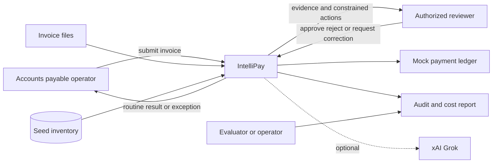
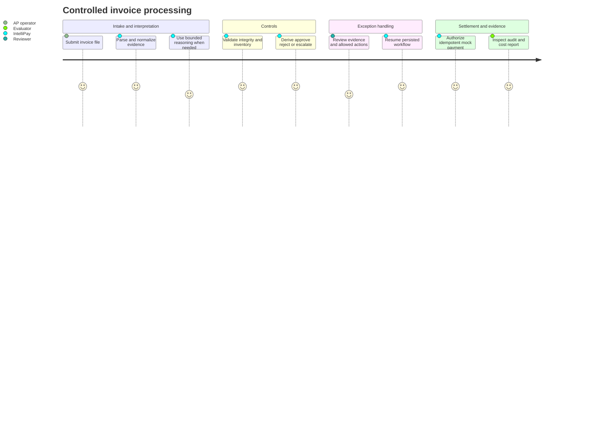
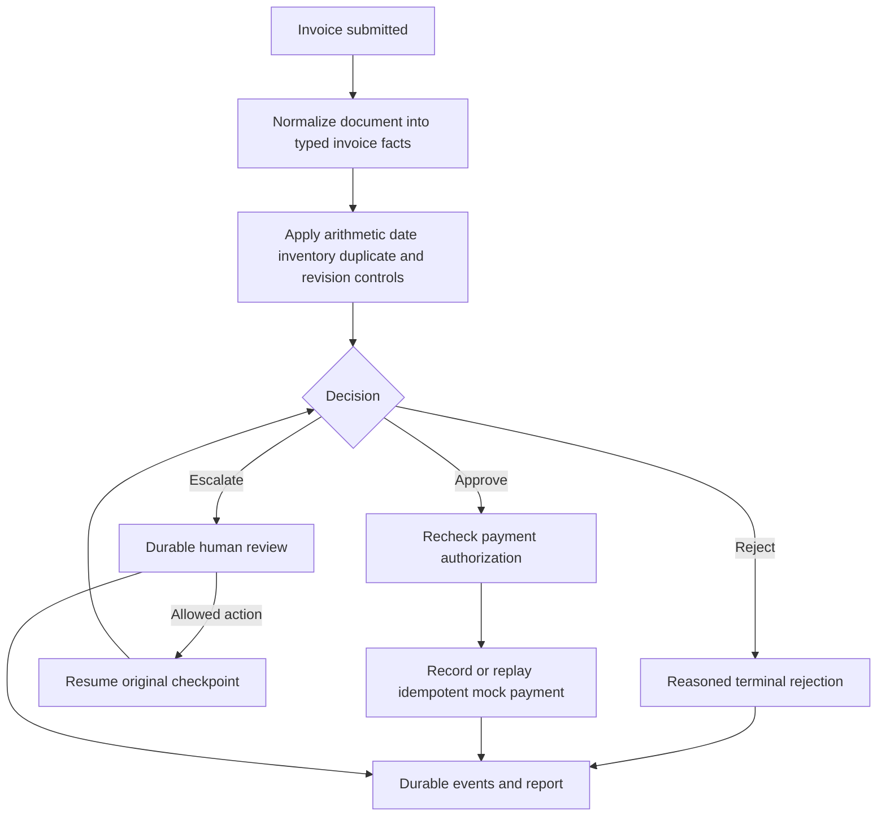
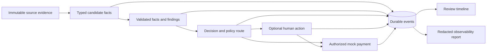

# IntelliPay Solution Architecture

## Purpose

This document explains how the implemented IntelliPay prototype addresses Acme Corp's invoice-processing problem. It connects users, business outcomes, workflow capabilities, controls, and operational evidence. The [technical architecture](architecture.md) provides the lower-level runtime, persistence, and trust-boundary view. The earlier [proposed solution](../analysis/proposed-solution.md) remains the original design proposal; this document describes the tool as it exists now.

## Problem and Outcome

Acme's baseline is a 30% invoice-processing error rate, a five-day manual cycle, and an estimated $2 million in annual avoidable cost. IntelliPay demonstrates a controlled path for reducing routine handling while keeping uncertain, high-risk, or invalid cases away from payment.

The prototype proves these outcomes:

- Known invoice formats can be normalized and checked automatically.
- Ambiguous extraction can use bounded local or live Grok reasoning.
- Hard financial and inventory controls remain deterministic.
- High-value or uncertain cases pause for constrained human review.
- Accepted invoices reach an idempotent mock payment.
- Duplicate submissions and conflicting revisions cannot create duplicate payment.
- Durable events, reasoning usage, and estimated model cost are inspectable after processing.

It does not claim measured production savings, production-grade identity, or connection to a real banking system.

## Actors and Systems

| Actor or system | Current role |
|---|---|
| AP operator | Starts processing through the CLI or demo runner and reads the outcome |
| Reviewer | Examines source evidence, normalized facts, findings, policy route, and timeline before taking an allowed action |
| Evaluator/operator | Validates the generated observability report and optional telemetry |
| Invoice files | Supply JSON, XML, CSV, TXT, or PDF evidence |
| Seed inventory | Supplies authoritative item existence and stock values for prototype checks |
| xAI Grok | Optionally performs structured extraction or critique through the reasoning-provider boundary |
| Mock payment ledger | Records authorized payment and detects replay through an idempotency key |

## End-to-End Solution Flow

## Capability Map

| Business need | Implemented capability | Evidence |
|---|---|---|
| Reduce manual handling | Deterministic parsers and straight-through processing for accepted low-risk invoices | Demo routine-automation scenario and corpus evaluation |
| Reduce invoice errors | Typed canonical invoice plus arithmetic, required-field, date, currency, and inventory findings | Review evidence and validation events |
| Handle imperfect documents | Local deterministic reasoning or live Grok extraction, typed critique, and one bounded repair | Reasoning trace and repair-attempt count |
| Prevent unsafe payment | Hard findings block payment; authorization is separate from recommendation | Workflow route and payment-authorization events |
| Prevent duplicate cash movement | Persistent idempotency ledger and business-invoice revision checks | Replay and revision-safety scenarios |
| Preserve human control | LangGraph interrupt, constrained actions, rationale, and checkpoint resume | Review queue and per-run timeline |
| Explain outcomes | Source evidence, normalized facts, finding codes, policy route, and ordered events | Review UI |
| Measure model use | Exact or estimated token usage with versioned pricing | Markdown observability report and evaluation report |
| Support audit | Append-only durable SQLite events with monotonic export sequence | JSONL export and Markdown event chronology |

## Decision and Authority Model

The workflow has exactly three terminal recommendations:

| Outcome | Meaning | Payment effect |
|---|---|---|
| `APPROVE` | Facts and deterministic controls permit progression | Still requires the payment-authorization node |
| `REJECT` | A hard or invalid condition prevents progression | Payment unavailable |
| `ESCALATE` | Human judgment or correction is required | Workflow pauses; available actions remain policy-constrained |

Authority is deliberately separated:

- Reasoning providers interpret and critique; they do not grant approval authority.
- Deterministic code owns financial, inventory, duplicate, and revision controls.
- Reviewers may select only actions allowed for that review task.
- The authorization node owns the final payment precondition check.
- The payment adapter owns idempotent recording and replay detection.

## Reasoning Roles

IntelliPay is best described as a controlled agentic workflow with multiple specialized reasoning roles:

| Role | Contribution | Constraint |
|---|---|---|
| Extraction | Converts ambiguous source content into typed candidate facts | Output must validate against the canonical schema |
| Extraction critic | Identifies defects in evidence or normalized values | Cannot directly mutate accepted facts |
| Repair | Produces one bounded correction attempt | Exhaustion escalates rather than guessing |
| Decision critic | Reviews selected higher-risk recommendations | Cannot weaken deterministic findings or authorize payment |

These roles share typed LangGraph state. They do not independently negotiate, delegate arbitrary tasks, or operate with unrestricted tools, so the system is not presented as an unconstrained autonomous multi-agent architecture.

## Demonstrated Scenarios

The executable presentation processes eight scenarios against one isolated database:

1. Routine automation creates one authorized mock payment.
2. Replay protection reuses the existing payment.
3. Bounded correction repairs one ambiguous amount.
4. A valid high-value invoice pauses for approvable human review.
5. Insufficient stock pauses for review but keeps approval disabled.
6. Invalid financial data reaches hard rejection.
7. An original invoice version creates one payment.
8. A conflicting revision escalates and cannot create another payment.

After processing, the demo writes `.intellipay/observability-report.md` and starts the approval UI against the same persisted state. The intended evaluator flow is documented in the [local demo and observability guide](../local-demo-and-observability.md).

## Information and Evidence Flow

The original source remains the evidence baseline. Normalized facts, findings, review actions, and payment status are recorded as distinct stages rather than silently overwriting the source. Sensitive reviewer and payment values are redacted in exported reports.

## Current Deployment and Integrations

| Boundary | Current implementation | Production integration not yet implemented |
|---|---|---|
| Intake | Local file path and demo corpus | Email connector or authenticated intake API |
| Reasoning | Deterministic local provider or live xAI Grok | Enterprise model gateway and model governance |
| Reference data | Seed SQLite inventory | Vendor master, PO, goods receipt, contract, tax, and FX systems |
| Identity | HTTP Basic authentication for the local review UI | Enterprise SSO, RBAC, and delegated approval limits |
| Payment | Local mock ledger | Treasury or banking gateway with dual control and reconciliation |
| Persistence | Local SQLite database | Managed transactional database and encrypted object storage |
| Observability | Durable events, Markdown/JSONL reports, optional OTLP | Central immutable audit archive and production alerting |

These are explicit prototype boundaries. The current demonstration does not imply that deferred production integrations exist.

## Quality and Operational Evidence

- The evaluation corpus compares expected routes and findings across supplied invoice formats and scenarios.
- Unit, workflow, review, payment, reasoning, telemetry, and pricing tests exercise the implemented controls.
- The generated observability report records event counts, chronological redacted events, token usage, and estimated cost.
- Live-model tests are opt-in because they require network access and paid provider credentials.
- OpenTelemetry traces and metrics can be exported to the optional local Jaeger, Prometheus, and Grafana profile.

The [business case analysis](../analysis/business-case-analysis.md) describes the intended value. Current prototype evidence demonstrates functional controls and repeatability; it does not yet establish production cycle-time reduction, labor savings, or annualized financial benefit.

## Decision Record

The [architecture decision records](../adr/) document the choices that produced this solution, including deterministic-first processing, typed LangGraph orchestration, optional Grok integration, SQLite persistence, evidence lineage, constrained outcomes, idempotent payment, the server-rendered review interface, and OpenTelemetry. They are the durable record of decision context and trade-offs; this document describes the resulting current solution.