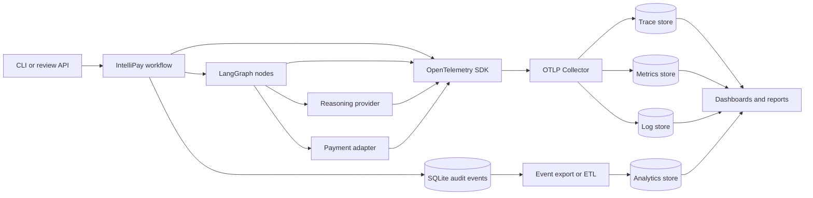

# Remaining Implementation Backlog

## Purpose

This document turns the current evidence gaps into implementable work. It covers engineering, operational evidence, presentation, and external validation without reopening capabilities that are already demonstrated.

The order is intentional: establish trustworthy observability first, use it to produce resilience and quality evidence, then package the demonstrated system for release and presentation.

## Current Baseline

- The complete offline suite passes 52 tests.
- All 20 supplied invoice files reach their expected route with zero prohibited payments.
- Deterministic parsing, bounded reasoning, human review, and replay-safe payment are implemented.
- Durable business events and typed reasoning traces are stored in SQLite.
- The review interface is authenticated and policy-constrained.
- Tabletop finance-label and AP-usability simulations are complete.

The remaining gaps are not a reason to redesign the workflow. They concern standard telemetry, missing fault scenarios, consolidated evidence, release packaging, and authorized external validation.

## Workstream Summary

| Priority | Workstream | Outcome | Primary readiness impact |
|---:|---|---|---|
| 1 | OpenTelemetry and analytics | Correlated traces, metrics, logs, and durable business events can be exported and queried | Code Quality, Presentation, Agentic Sophistication |
| 2 | Resilience and reconciliation | Database, restart, model, and payment failures reach defined safe states | Functionality, Code Quality, Above/Beyond |
| 3 | Quality and performance report | Accuracy, latency, model use, cost, and safety gates are generated reproducibly | Functionality, Presentation |
| 4 | Security, privacy, and limitations | Trust boundaries and unresolved risks have an owned disposition | Code Quality, Shipping Mindset |
| 5 | Clean acceptance run | A clean checkout reproduces setup and all acceptance evidence | Functionality, Shipping Mindset |
| 6 | Golden demo package | The strongest behavior and measured value fit a repeatable ten-minute narrative | Presentation, Above/Beyond, UI/UX |
| 7 | Immutable prototype release | Demonstrated source and evidence have a stable version identifier | Shipping Mindset, Presentation |
| 8 | External validation | Authorized labels and real AP usability baselines replace simulation-only evidence | Functionality, UI/UX, trust |

## 1. OpenTelemetry and Structured Analytics

### Goal

Make every invoice run observable from entry point through graph nodes, reasoning calls, review interruption/resume, storage, and payment while preserving an authoritative audit record suitable for financial controls.

### Value

- Explains where time and failures occur without reading application internals.
- Correlates graph behavior, model use, review actions, and payment outcomes.
- Produces latency, reliability, token, and queue metrics for acceptance and demos.
- Allows the destination to change without changing application instrumentation.
- Preserves financial audit events even when operational telemetry is sampled or unavailable.

### LangGraph and OpenTelemetry Compatibility

Yes, OpenTelemetry can be wired into this application. Official LangChain documentation supports OpenTelemetry tracing for LangChain and LangGraph applications and standard OTLP export to LangSmith or alternate providers. LangGraph graph invocations also accept runnable configuration and expose graph execution as traceable operations.

Use two complementary mechanisms:

1. **Explicit IntelliPay instrumentation:** create spans and metrics around workflow, provider, review, storage, and payment boundaries. This is the stable source of domain-specific attributes and does not depend on a hosted platform.
2. **Optional LangGraph/LangChain tracing:** enable the supported integration for framework-level child spans when deeper graph internals are useful. Export through the same collector and test for duplicate spans before enabling it by default.

Do not make LangSmith mandatory. Configure standard OpenTelemetry SDKs to send OTLP to an OpenTelemetry Collector. The collector may fan out to LangSmith, Grafana Tempo, Jaeger, Datadog, Honeycomb, or another OTLP backend.

### Required Architecture



### Audit and Telemetry Boundary

OpenTelemetry is not the financial audit ledger. Traces and metrics can be sampled, delayed, rejected, or expired. SQLite business events remain authoritative for decisions, review actions, and payment effects.

| Concern | Authoritative channel | Reason |
|---|---|---|
| Decision and payment audit | Durable business event | Must not depend on sampling or collector availability |
| Request and graph timing | OTel trace/span | Represents causal operational execution |
| Rates and distributions | OTel metric | Efficient low-cardinality aggregation |
| Diagnostic context | Structured log with trace context | Searchable operational detail |
| Business reporting | Versioned event export | Stable schema, replayable ingestion, auditable source |

Telemetry export failure must never change an invoice route, review action, or payment result.

### Span Model

Create this minimum hierarchy:

```text
intellipay.invoice.process
  intellipay.graph.invoke
    intellipay.node.extract
      intellipay.reasoning.extract
      intellipay.reasoning.critique
      intellipay.reasoning.repair
    intellipay.node.validate
      intellipay.storage.inventory.read
      intellipay.storage.invoice_relation.read
    intellipay.node.decide
      intellipay.reasoning.decision_critique
    intellipay.node.human_review
    intellipay.node.authorize_payment
    intellipay.node.pay
      intellipay.payment.record
```

Review requests should create HTTP server spans. A resumed review must either continue through a span link to the original run trace or start a new trace containing `intellipay.run.id` and an OTel link to the original trace. Do not hold a span open while waiting for a person.

### Resource and Span Attributes

Use OpenTelemetry semantic conventions where available and an `intellipay.*` namespace for domain attributes.

| Attribute | Scope | Notes |
|---|---|---|
| `service.name` | Resource | `intellipay-cli` or `intellipay-review` |
| `service.version` | Resource | Package version or release tag |
| `deployment.environment.name` | Resource | `local`, `test`, or configured environment |
| `intellipay.run.id` | Span/log/event | Primary correlation identity |
| `intellipay.document.format` | Span | Low-cardinality extension only |
| `intellipay.reasoning.mode` | Span/metric | `local` or `live` |
| `intellipay.graph.node` | Node span | Stable node name |
| `intellipay.route.outcome` | Root span/metric | `APPROVE`, `REJECT`, or `ESCALATE` |
| `intellipay.finding.codes` | Trace/event | Do not use an unbounded list as a metric label |
| `intellipay.repair.attempt` | Reasoning span | Bounded integer |
| `intellipay.review.action` | Review span/event | Approved action vocabulary only |
| `intellipay.payment.status` | Payment span/event | Never include account or credential data |
| `intellipay.payment.replayed` | Payment span/metric | Boolean idempotency evidence |
| `gen_ai.system` | Reasoning span | Provider identifier |
| `gen_ai.request.model` | Reasoning span | Configured model |
| `gen_ai.usage.input_tokens` | Reasoning span/metric | When returned by provider |
| `gen_ai.usage.output_tokens` | Reasoning span/metric | When returned by provider |

Do not export raw invoice text, prompts containing invoice text, model completions, rationale text, API keys, source hashes, payment IDs, or reviewer identities by default. High-cardinality identifiers belong in traces and events, not metric labels.

### Metrics

| Metric | Type | Required dimensions |
|---|---|---|
| `intellipay.runs` | Counter | outcome, reasoning mode |
| `intellipay.run.duration` | Histogram | outcome, reasoning mode |
| `intellipay.node.duration` | Histogram | node, status |
| `intellipay.reasoning.calls` | Counter | operation, provider, status |
| `intellipay.reasoning.duration` | Histogram | operation, provider, status |
| `intellipay.reasoning.tokens` | Counter | provider, model, direction |
| `intellipay.repair.attempts` | Histogram | operation, final status |
| `intellipay.review.open` | UpDownCounter or observable gauge | priority |
| `intellipay.review.age` | Histogram | priority, terminal status |
| `intellipay.payments` | Counter | status, replayed |
| `intellipay.failures` | Counter | boundary, safe state |

Metrics must use bounded dimensions. Never label a metric with run ID, invoice number, source name, finding message, rationale, or exception message.

### Structured Business Event Envelope

Migrate the current event payloads to a versioned envelope while preserving backward-readable data:

```json
{
  "schema_version": 1,
  "event_id": "evt_...",
  "event_type": "workflow.completed",
  "occurred_at": "2026-08-12T22:00:00Z",
  "run_id": "run_...",
  "trace_id": "32 lowercase hex characters or null",
  "span_id": "16 lowercase hex characters or null",
  "producer": {
    "service": "intellipay-cli",
    "version": "0.1.0"
  },
  "subject": {
    "document_format": "txt",
    "invoice_reference": "tokenized or omitted"
  },
  "data": {
    "outcome": "ESCALATE",
    "finding_codes": ["HIGH_VALUE"]
  }
}
```

Use UUID/ULID-style event identity, UTC timestamps, dot-delimited event names, typed data models, and an explicit schema version. Add `trace_id` and `span_id` at event creation so business reports can link to operational traces.

### Storage and Consumption

Implement storage in increments:

1. **Local acceptance:** in-memory or console exporter in tests plus an OTLP Collector with debug/file output. Verify span shape without requiring a hosted service.
2. **Prototype dashboards:** Collector to Tempo or Jaeger for traces and Prometheus for metrics; structured logs to Loki if log analysis is required.
3. **Business analytics:** export durable event envelopes through an outbox cursor to JSONL, Parquet, PostgreSQL, or ClickHouse. Consumers checkpoint by `event_id`; retries are idempotent.
4. **Optional fan-out:** add LangSmith or another backend in collector configuration, not application code.

For this prototype, SQLite remains the source event store. Do not write every OTel span into the application database. Add an event-export command that supports a time/event cursor and emits newline-delimited JSON; this creates a stable ingestion boundary for any analytical store.

### Implementation Items

- [ ] Record an ADR selecting vendor-neutral OTel SDK plus Collector and preserving the audit/telemetry boundary.
- [ ] Add `opentelemetry-api`, `opentelemetry-sdk`, and OTLP exporter dependencies.
- [ ] Add optional FastAPI and HTTP client instrumentation where it produces useful spans.
- [ ] Add settings for enablement, service name/version, environment, OTLP endpoint, protocol, headers, sampling ratio, and export timeout.
- [ ] Default tests and local CLI runs to no-op telemetry unless explicitly enabled.
- [ ] Create one telemetry bootstrap module; do not initialize providers at import time.
- [ ] Add explicit root workflow, review-resume, reasoning, payment, and storage spans.
- [ ] Evaluate framework-generated LangGraph spans and suppress duplication before enabling them.
- [ ] Add trace/span correlation to structured logs and durable event envelopes.
- [ ] Add low-cardinality counters and histograms from the table above.
- [ ] Add migration and typed models for versioned event identity and trace correlation.
- [ ] Add `intellipay-export-events` with cursor-based JSONL output.
- [ ] Add a local Collector configuration with debug/file output and health check.
- [ ] Document a sample backend topology without making it required for offline tests.
- [ ] Add redaction tests proving source text, secrets, rationale, and raw model content are absent.
- [ ] Add exporter-down tests proving workflow and payment behavior are unchanged.
- [ ] Add integration tests that assert parent/child spans and run ID correlation.

### Acceptance Criteria

- One invoice produces a root trace with named graph-node, reasoning, storage, and payment/review spans.
- `run_id` links the trace, structured logs, durable events, and workflow result.
- A review resume is linked to the original run without an hours-long open span.
- Metrics report route count, p50/p95 run and node latency, model calls/tokens, repair rate, review age, and payment replay count.
- Event export can be replayed into a blank consumer without duplicates.
- Collector or exporter failure does not alter route, payment, or persisted audit events.
- No secrets or raw invoice/model/reviewer content appear in default telemetry.
- The complete offline test suite remains independent of a collector or network.

## 2. Resilience and Reconciliation

### Goal

Prove that failures at persistence and payment boundaries cannot create a false approval, lost decision, or duplicate payment.

### Implementation Items

- [ ] Add injectable payment outcomes: success, known failure, timeout before acceptance, and unknown result after acceptance.
- [ ] Persist payment intent before invoking the adapter.
- [ ] Add lookup by idempotency key and reconciliation without blind resubmission.
- [ ] Represent pending/unknown payment states explicitly in the domain model and UI.
- [ ] Inject SQLite lock contention and assert bounded handling with no partial financial side effect.
- [ ] Terminate after checkpoint/review/payment boundaries and prove process restart resumes safely.
- [ ] Add malformed checkpoint and missing-checkpoint behavior with explicit errors.
- [ ] Emit correlated telemetry for each injected failure and resulting safe state.

### Acceptance Criteria

- Every injected model and payment outage reaches a documented safe state.
- Unknown payment results are queried by idempotency identity before any retry.
- SQLite lock and process restart tests produce zero duplicate payments and decisions.
- Failure evidence is visible in both durable events and operational traces.

## 3. Quality, Performance, and Cost Report

### Goal

Generate one machine-readable and human-readable report that demonstrates quality gates and exposes weak segments instead of relying on aggregate pass counts.

### Implementation Items

- [ ] Version canonical required-field expectations independently from route labels.
- [ ] Calculate required-field extraction accuracy overall and by format/field.
- [ ] Report finding precision/recall and route confusion matrix.
- [ ] Add deterministic mutation cases for OCR swaps, removed fields, changed totals, currency changes, duplicates, and prompt injection.
- [ ] Use OTel measurements for p50/p95 end-to-end and node latency.
- [ ] Report model calls, repairs, tokens, timeout rate, and estimated cost when usage exists.
- [ ] Report payment attempts, successes, replays prevented, and prohibited payments.
- [ ] Add configured thresholds and a machine-readable pass/fail gate.

### Acceptance Criteria

- Required-field accuracy meets the approved prototype threshold.
- Hard-control recall is 100% and prohibited payments are zero.
- Latency and model-use sections are populated from reproducible telemetry.
- Every failed threshold links to case-level evidence.

## 4. Security, Privacy, and Limitations

### Goal

Make trust assumptions, data exposure, and deferred production controls explicit and reviewable.

### Implementation Items

- [ ] Threat-model document ingestion, model calls, review authentication, SQLite files, event export, and OTLP export.
- [ ] Verify secrets never enter graph state, checkpoints, logs, events, or telemetry.
- [ ] Define redaction, retention, and access rules for source documents and reviewer rationale.
- [ ] Document HTTP Basic as a prototype-only boundary and list production identity requirements.
- [ ] Review dependency and container vulnerabilities using a reproducible command.
- [ ] Consolidate unresolved business policy and production deferrals in one limitations register.
- [ ] Assign an owner and disposition to every high-risk finding.

### Acceptance Criteria

- No critical security issue remains open for prototype use.
- Every accepted limitation has an owner, rationale, and production trigger.
- Telemetry and event export pass explicit sensitive-data tests.

## 5. Clean Acceptance Run

### Goal

Prove another evaluator can reproduce the demonstrated behavior from a clean checkout without hidden local state.

### Implementation Items

- [ ] Add one acceptance script or task that performs dependency sync, lint, format check, tests, corpus evaluation, and representative CLI runs.
- [ ] Use temporary database paths and verify migrations from zero.
- [ ] Start the review server, run a health check, and exercise one review through HTTP.
- [ ] Start the local OTel Collector when telemetry acceptance is enabled.
- [ ] Capture tool versions, command output, elapsed time, and artifact hashes.
- [ ] Add troubleshooting for OCR runtime, ports, credentials, and database locks.

### Acceptance Criteria

- The complete run succeeds from a clean clone with no manual database preparation.
- Generated evidence is deterministic except for documented IDs and timestamps.
- No live credential or network access is required for default acceptance.

## 6. Golden Demo Package

### Goal

Present the business problem, controlled agent behavior, financial safety, reviewer experience, and measured results in ten minutes or less.

### Implementation Items

- [ ] Write a timed script covering INV-1001 approval and replay, bounded repair, INV-1002 review, INV-1009 rejection, and INV-1004 revision safety.
- [ ] Add commands that seed each demo state deterministically.
- [ ] Capture queue, detail, disabled approval, completed review, and mobile screenshots.
- [ ] Show one OTel trace with node timing and one quality-report summary.
- [ ] Include the 30% error, five-day cycle, and $2M annual-loss baseline without claiming unmeasured savings.
- [ ] Add a fallback recording or static evidence pack for demo-environment failure.

### Acceptance Criteria

- Two consecutive rehearsals finish within ten minutes from documented setup.
- Every claim shown in the demo links to a command, test, trace, or report.
- Deferred production controls and external evidence are stated plainly.

## 7. Immutable Prototype Release

### Goal

Bind source, dependencies, evaluation labels, reports, and demo evidence to one reproducible version.

### Implementation Items

- [ ] Choose a release version after the clean acceptance gate passes.
- [ ] Record source commit, lockfile hash, manifest hash, report hash, and policy version.
- [ ] Create release notes summarizing demonstrated behavior and limitations.
- [ ] Create an annotated Git tag only after evidence review.

### Acceptance Criteria

- A checkout of the release tag reproduces the acceptance report.
- Report and demo artifacts identify the same source version.

## 8. External Validation

### Goal

Replace simulated business review with evidence from authorized finance and representative accounts-payable participants.

### Implementation Items

- [ ] Obtain authorized approval of all 20 `simulated-reviewed` labels using the finance/domain runbook.
- [ ] Run AP usability sessions and record comprehension, handling time, confidence, help requests, and incorrect actions.
- [ ] Resolve blocking and major findings or record explicit owner acceptance.
- [ ] Regenerate evaluation evidence after any authorized label change.

### Acceptance Criteria

- Every label has authorized reviewer identity, date, rationale, and approval status.
- No blocking usability issue remains open.
- Human baselines are reported separately from tabletop simulation results.

## Recommended Delivery Order

1. Record the observability ADR and implement OTel bootstrap, root spans, correlation, and local Collector output.
2. Add payment unknown-state reconciliation and the missing lock/restart fault tests.
3. Build event export plus quality/performance report generation from durable events and telemetry.
4. Complete the security/privacy/limitations review and telemetry redaction tests.
5. Run and capture clean acceptance evidence.
6. Package and rehearse the golden demo.
7. Tag the immutable prototype.
8. Complete external validation when authorized participants are available.

Do not block the default offline workflow on OpenTelemetry, a collector, LangSmith, or any hosted analytics store.

## Decisions Required Before Implementation

| Decision | Recommended default | Owner |
|---|---|---|
| Primary OTel backend | Local Collector with debug/file first; backend selected later | Engineering |
| Optional LLM trace UI | LangSmith via collector fan-out, disabled by default | Engineering/security |
| Trace sampling | Always-on for local acceptance; parent-based ratio in deployed environments | Engineering/security |
| Business analytics store | JSONL export contract first; PostgreSQL or ClickHouse when needed | Engineering/data |
| Telemetry retention | Short operational retention, distinct from audit retention | Security/operations |
| Invoice/reviewer identifiers | Omitted or tokenized by default | Security/finance |
| Accuracy threshold owner | At least 95% proposed; requires authorized approval | Finance/product |
